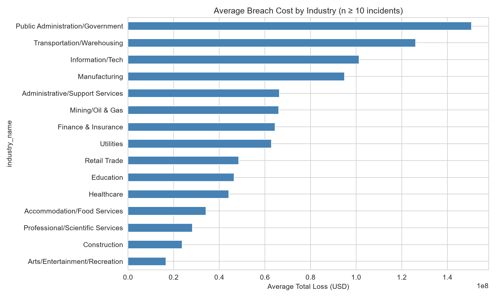
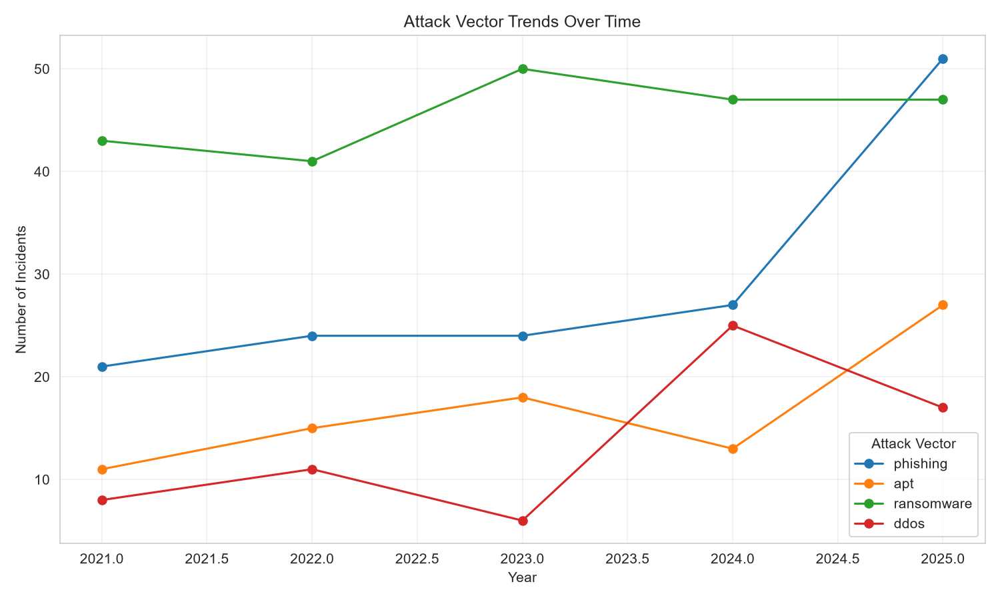
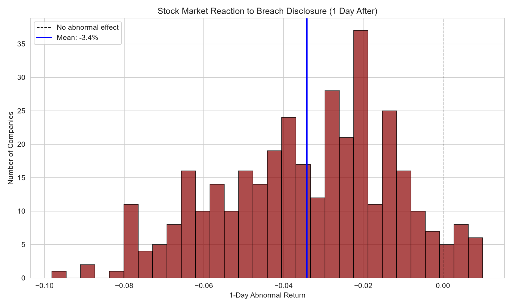
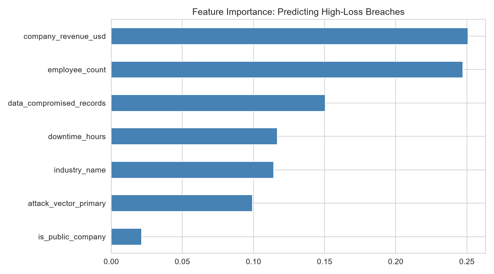

# Cybersecurity Breach Impact Analysis

Analyzing 850 real-world cybersecurity incidents (2021–2025) to understand what drives breach cost, how attack methods are evolving, and whether the stock market actually punishes public companies for security failures.

## The Question

When a company suffers a cyberattack, what predicts how expensive it is — and does the market actually react?

## Data

Sourced from Kaggle: [Cybersecurity Breach Impact Dataset](https://www.kaggle.com/datasets/algozee/cyber-security), covering 850 incidents from 2021–2025 across three linked tables:
- **Incidents** — company details, industry, attack type, dates
- **Financial impact** — ransom demands/payments, recovery costs, legal fees, regulatory fines
- **Market impact** — stock price reaction and abnormal returns for public companies (event-study methodology, ~358 companies)

## Key Findings

**1. Breach cost varies significantly by industry — but sample size matters.**
Public Administration/Government and Transportation/Warehousing see the highest average losses among industries with reliable sample sizes (n ≥ 10). Notably, frequently-discussed sectors like Healthcare and Finance rank mid-pack once small-sample noise is filtered out — frequency of breaches and severity of cost are not the same thing.

**2. The 2025 spike in incidents is driven by specific attack types, not uniform growth.**
Phishing incidents nearly doubled from 2024 to 2025 (27 → 51), and APT (advanced persistent threat) incidents also doubled (13 → 27), while ransomware stayed flat and DDoS actually declined. The overall rise in attacks is concentrated in a couple of methods, not a general increase across the board.

**3. The stock market reacts negatively almost every time — but the effect is often small.**
Nearly the entire distribution of 1-day abnormal stock returns after breach disclosure sits below zero (mean: -3.4%), but only 18.4% of these reactions were statistically significant. This suggests breaches consistently hurt stock price on average, but for many companies the effect is within normal day-to-day volatility rather than a dramatic, unambiguous market punishment.

**4. Company size — not industry or attack type — is the strongest predictor of breach cost.**
A random forest model predicting whether a breach results in above-median financial loss achieved 65% accuracy (vs. a 50% random baseline). Company revenue and employee count were by far the most important features, together accounting for roughly half the model's decisions. Being a publicly traded company barely mattered for predicting cost — it affects whether markets react, but not how expensive the breach itself is.

## Model Performance

- **Accuracy:** 65% (baseline: 50%)
- **Class recall:** 74% for low-loss incidents, 55% for high-loss incidents
- The model catches low-cost breaches more reliably than high-cost ones, suggesting company/attack metadata alone captures some — but not most — of what drives breach severity. Likely missing factors: incident response quality, legal negotiation outcomes, and jurisdiction-specific regulatory exposure, none of which are present in this dataset.

## Tech Stack

Python · pandas · scikit-learn · matplotlib · seaborn

## Project Structure